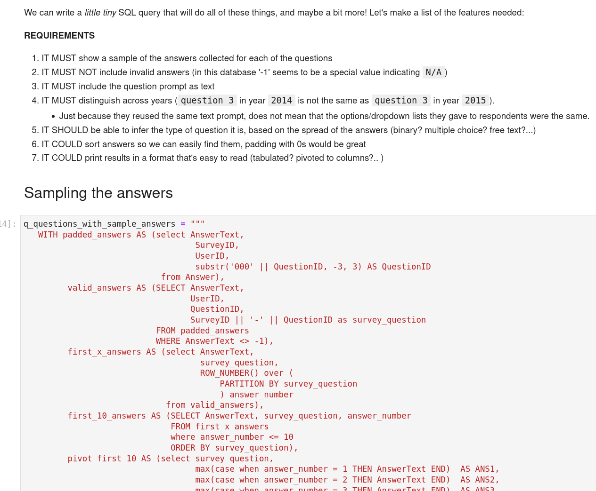
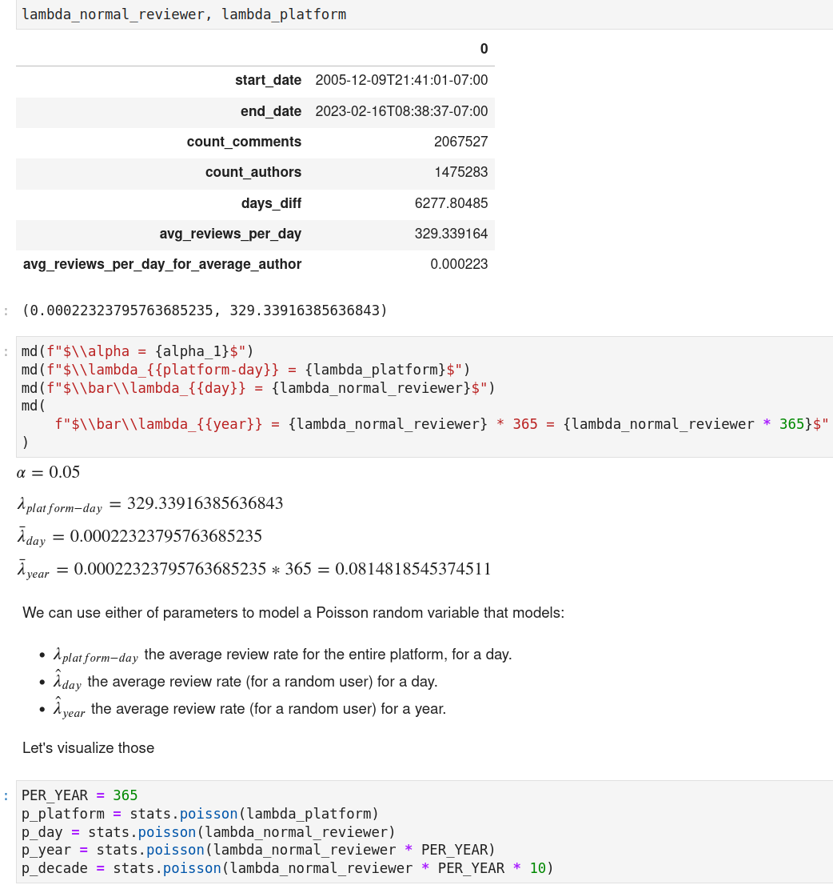
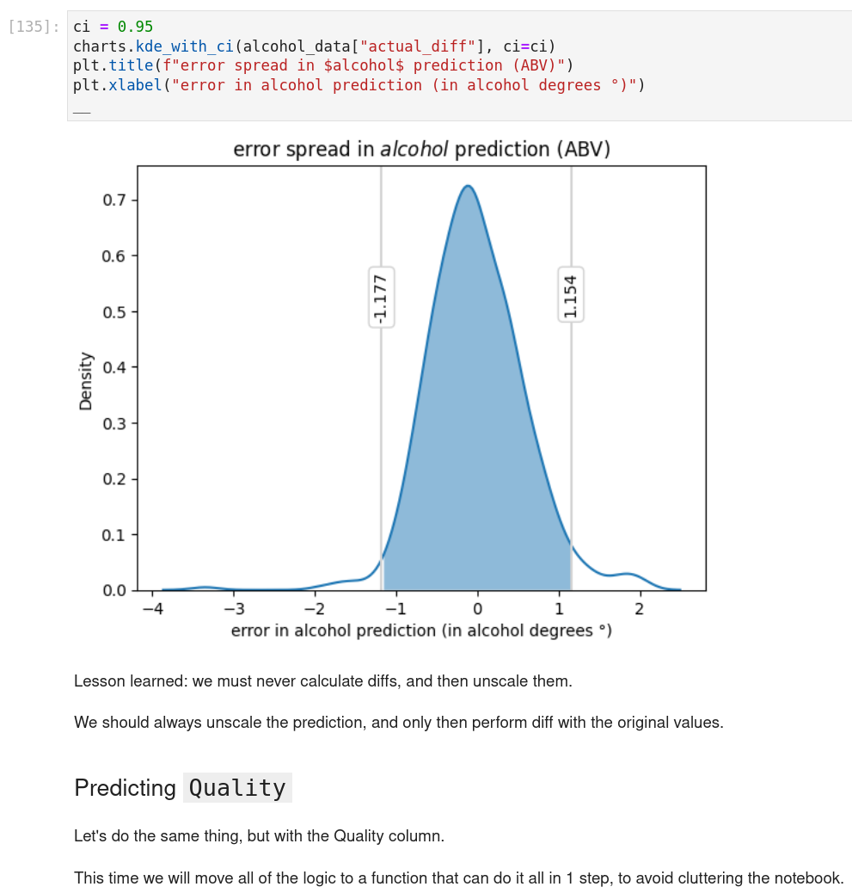
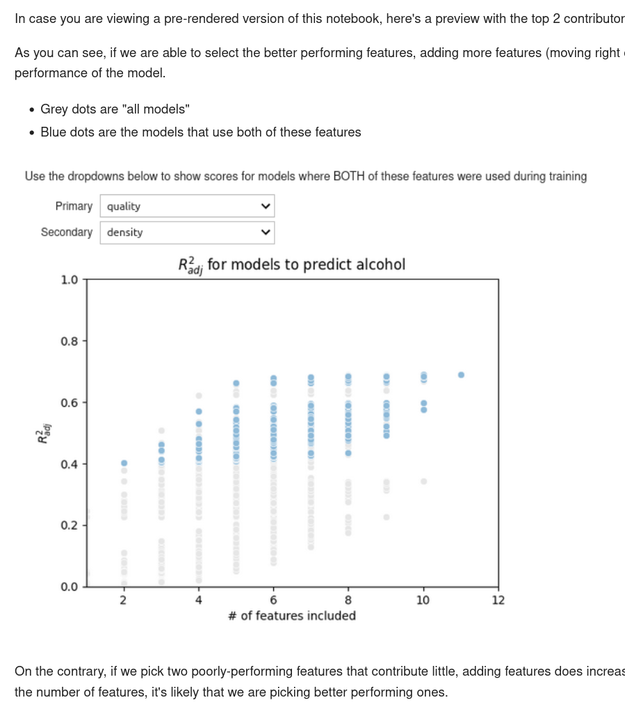
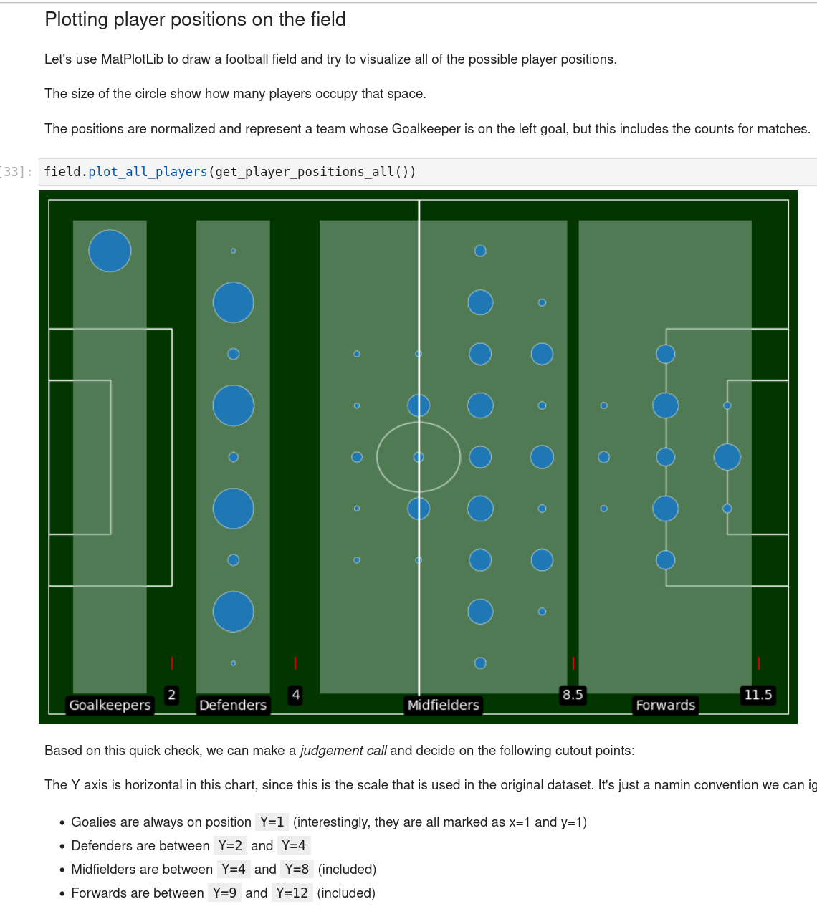
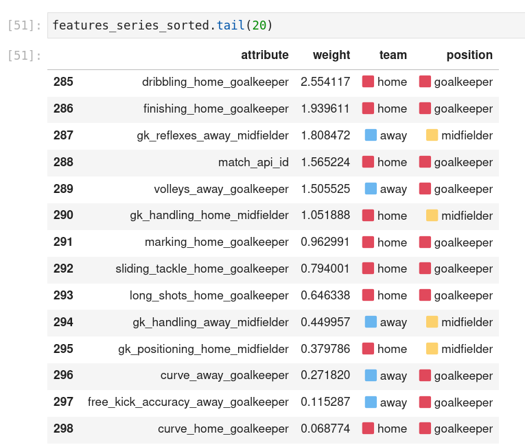

# Module 2 - Data Analysis

Module 2 is about data analysis:

- SQL
- Statistics and Probability
    - Uni-variate and Multivariate Data Analysis
    - Descriptive Statistics
    - Statistical Inferential Analysis
    - Hypothesis Testing
    - Confidence Intervals and Significance (p-value)
    - A/B Testing
    - Bayesian Statistics
- Modelling Fundamentals
    - Linear & Logistic Regression
    - Statistical Modelling
- Libraries/Frameworks
    - sqlite3 & duckdb
    - scikit-learn
    - SciPy/scipy-stats

## Sprint 5 - Mental Health Dataset

**Project Requirements**: This project is about being able to use our own judgement to perform unguided exploratory data analysis and choosing the most promising avenues of EDA. It's about iteratively raising hypotheses and use your data analysis skills to extract answers.

**Key Learnings**:
- advanced SQL
- duckdb
- statistical inference

**Personal Reflection**: This project was an opportunity to look into a mental health dataset that spanned across years and companies.

I used this opportunity to explore privilege and axes of oppression in different populations of employees in the tech industry: from psychological safety in different companies and teams, to potential indicators that might highlight situations that would benefit from further investigation.

**Reviewer's highlights**:

> Score: 100

> This is by far the most complete submission for this exercise I have seen to date! 👏 well done!
> Some of the things that make your work stand out:
> - nice goal setting, which gives very clear direction and scope for your analysis.
> - pragmatic about which data is useful
> - duplicate investigation is very thorough with logical outcomes.
> - advanced SQL skills
> - awesome that you are considering the ethical issues of the questionnaire
> - great python skills: utility functions with type hints, docstrings, and clean code practices.
> - I loved your "product thinking", e.g. allowing users to make a "no answer" if they don't feel comfortable, instead of providing an incorrect one.

Check out the project in [Github](https://github.com/TuringCollegeSubmissions/ealmas-DA.1)

## Sprint 6 - Podcast Reviews

**Project Requirements**: This project is about applying the learned statistical tools to a dataset with very few numerical features.

**Key Learnings**:
- advanced SQL
- problem and data modelling
- advanced statistical inference
- anomaly and outlier detection
- modelling of timed events
- frequency analysis to detect bot-like reviewers

**Personal Reflection**:
This project allowed for a deep dive into using statistical inference tools to find anomalous datapoints that could be attributable to bots.

The main approach was to model podcast reviews using a poisson distribution using the review's timestamp, and then using that to determine various cutoff points to identify particular users who were posting far beyond the expected ranges and frequencies.

**Reviewer's highlights**:

> Score: 98

> Amazing project! Well done 👍 
> * Great use of duckdb
> * Interesting investigation of review anomalies
> * Good understanding of statistical concepts
> * Well communicated and presented project
> * Nicely formatted visualisations that are easy to understand
> * Very interesting insights and conclusions

Check out the project in [Github](https://github.com/TuringCollegeSubmissions/ealmas-DA.2)

## Sprint 7 - Wine

**Project Requirements**: This is the first project where we can apply supervised machine learning to try to predict various features from a portfolio of wine products sold by a vineyard.

**Key Learnings**:
- supervised machine learning
	- linear regression
	- logistic regression
- domain modelling
- manual & automated feature selection
- manual & automated feature engineering
- scikit learn pipelines for data transformation and preprocessing
- interactive notebooks

**Reviewer's highlights**:
> Score: 95

> Eduard, your project is very impressive. You thought about small details and your analysis is at very good depth. I mean feature engineering part looks like from research paper :) very solid looking work.

Check out the project in [Github](https://github.com/TuringCollegeSubmissions/ealmas-DA.3)

## Sprint 8 - Football

**Project Requirements**: Analyze 25,000 matches and player data to try to beat the odds and predict match outcomes.

**Key Learnings**:
- EDA and Data modelling
- Supervised Machine learning
- Model selection
- Feature selection
- Feature engineering
- Understanding Business context and avoiding accidental data leakage

**Reviewer's highlights**:
> Score: 100

> Eduard, very good presentation. All parts are covered and explained nicely, not too long not to deep. Good balance between details and actual take away points. A lot of extra steps: pipelines, different statistical/ML models, explanations. All this brings the bar of quality even higher! Good job. It is easy to discuss with you about different topic of projects because you trying to get into it. Again, truly good project from e2e. 
> * Impressive depth of analysis 
> * Extracting features with highest importance and building appropriate models
> * Thorough thoughts explanations
> * Timing and checking for memory usage

Check out the project in [Github](https://github.com/TuringCollegeSubmissions/ealmas-DA.4)

# Module 3

Continue to ⏩ [Module 3 - Machine Learning](module3.md) to review the next set of projects.

