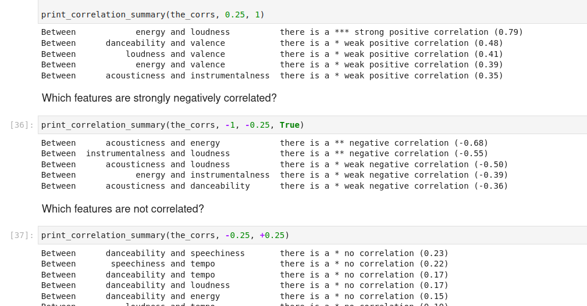

# Turing College Projects

This page contains a summary of the projects submitted during this 18 months online self-paced bootcamp.

## Admission Test

In 2022, as a prerequisite for admission, Turing College required the submission of a sample project.

Turing College provided essential resources and theoretical knowledge, and successful applicants had a chance to
receive a scholarship for their studies.

This first project is for this Admission Test. I am delighted to share that my submission resulted in me being accepted
with a 100% grant for my studies.

### Sprint 0 - Implementing `K-Nearest Neighbors` from scratch

```python
from random import sample, seed
from typing import Iterable, Dict, Tuple

Point = Tuple[float, ...]
Centroid = Point
Clusters = Dict[Centroid, Iterable[Point]]

```

This initial project required implementing the KNN clustering algorithm from scratch in pure python, without any
external libraries (no `scikit-learn`, `numpy`,...) on the iris dataset.

**SUMMARY**: This challenge is designed to assess fluency and familiarity with software development, as well as the
ability to learn new concepts and being able to apply them to solve a particular problem/task.

Despite being the first time I programmed in Python, my previous experience as a software developer
was really useful and allowed me to implement a solution with relative ease. Looking back at the code I wrote over a
year ago, it comes off as crude, and you can tell it is strongly influenced by other languages instead of using a
pythonic style.

|                     |                                                                                        |
|---------------------|----------------------------------------------------------------------------------------|
| Something I enjoyed | Learning a new language from scratch                                                   |
| Something I learned | KNN Clustering, Downloading datasets, Partial function application                     |
| Something fun       | I didn't know that the term was "Pythonic" so I wrote "python-esque" in some comments! |

## Module 1 - Data Wrangling with Python

Module 1 is all about learning the basics:

- Skills
    - Python
    - Data Analysis
    - Data Cleaning
    - Data Visualization
    - Storytelling
    - Analyzing simple datasets
    - Communicating conclusions and outcomes
- Libraries/Frameworks
    - Numpy
    - Pandas
    - Docker
    - REST APIs
    - Matplotlib
    - Plotly
    - Seaborn
    - [PyPI](https://pypi.org/) package deployments

### Sprint 1

```python
calc = Calculator()
calc.enter(5)
    .plus(4)
    .times(4)
    .times(10)
    .divided_by(2)
    .plus(45)
    .root()
    .ans()

> (15.0, -15.0)
```

### Sprint 2


|                     |                                                                                                                                   |
|---------------------|-----------------------------------------------------------------------------------------------------------------------------------|
| Something I enjoyed |                                                                                                                                   |
| Something I learned |                                                                                                                                   |
| Something fun       | As someone who loves musical puns, this is the only dataset where I can have a variable called `the_corrs` to store correlations! |




### Sprint 3

### Sprint 4

## Module 2 - Data Analysis

### Sprint 5

### Sprint 6

### Sprint 7

### Sprint 8

## Module 3 - Machine Learning

### Sprint 9

### Sprint 10

### Sprint 11

### Sprint 12

## Module 4 - Deep Learning (Optional)

### Sprint 13

### Sprint 14

### Sprint 15

### Sprint 16

Visualization and Storytelling

