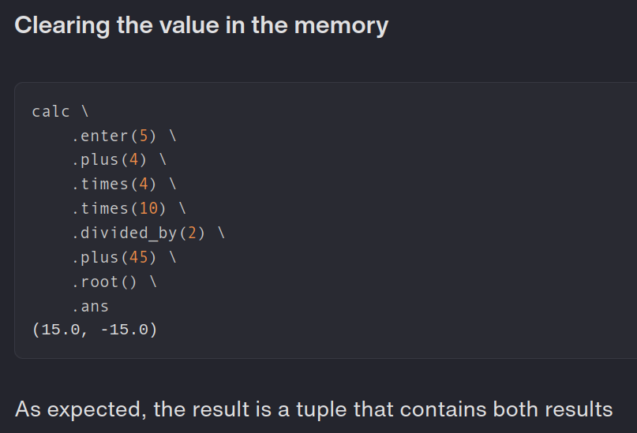
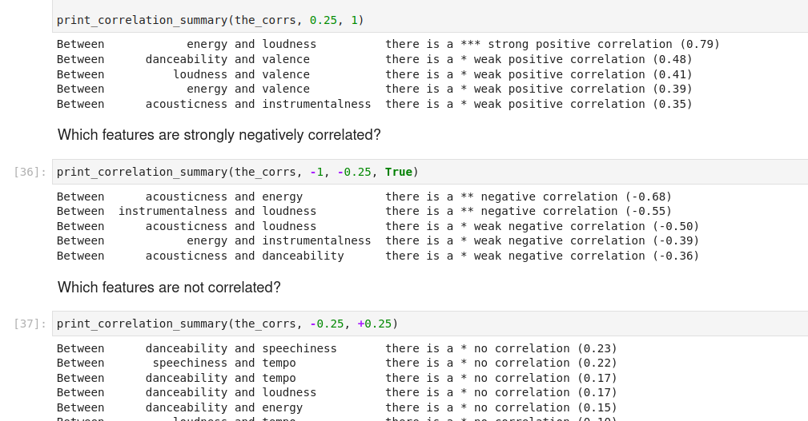
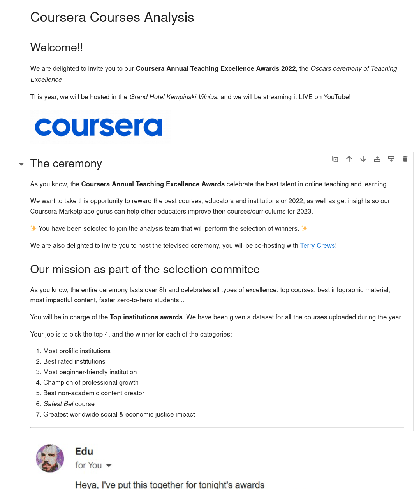
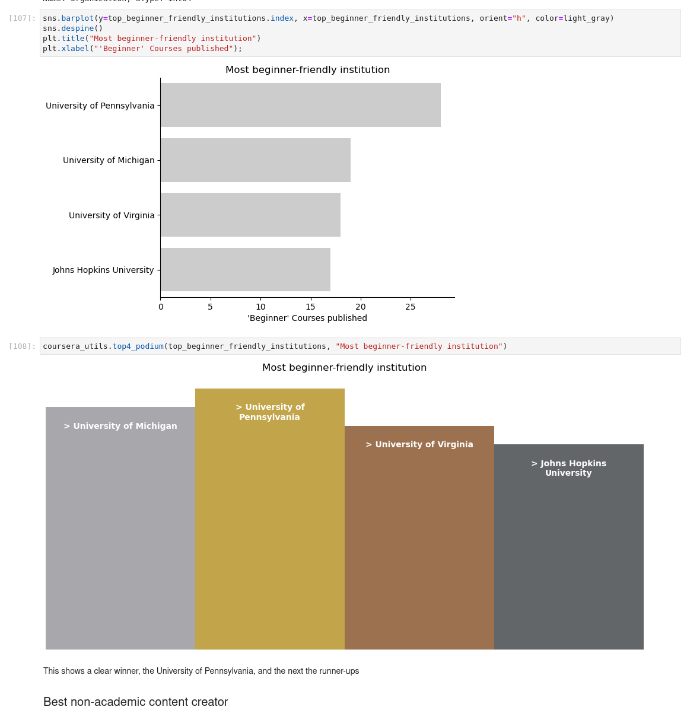
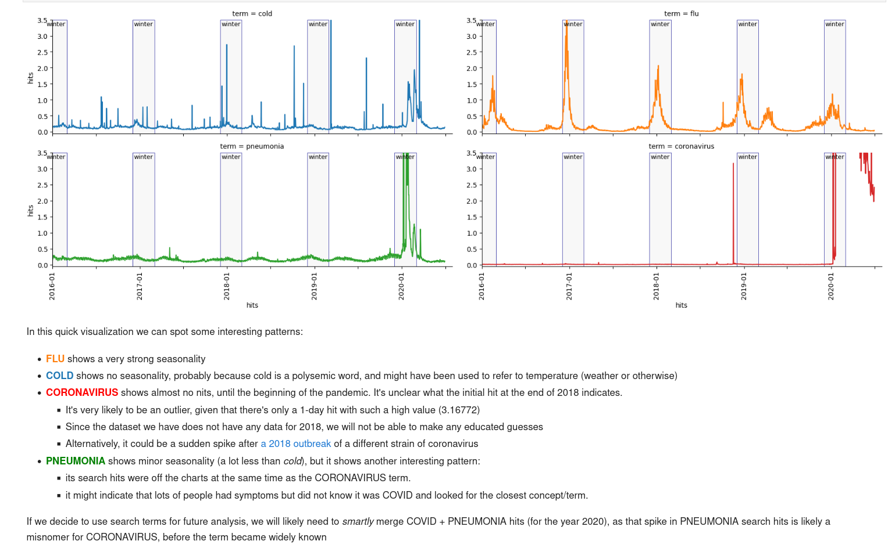
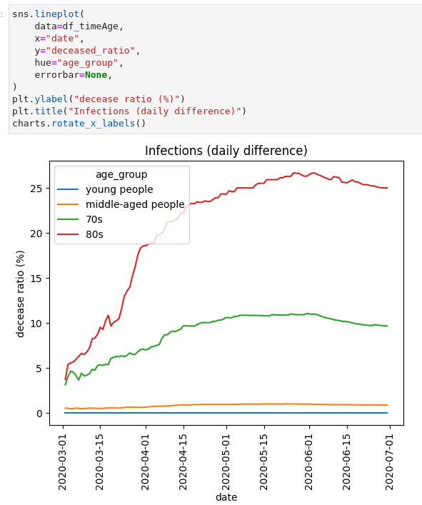
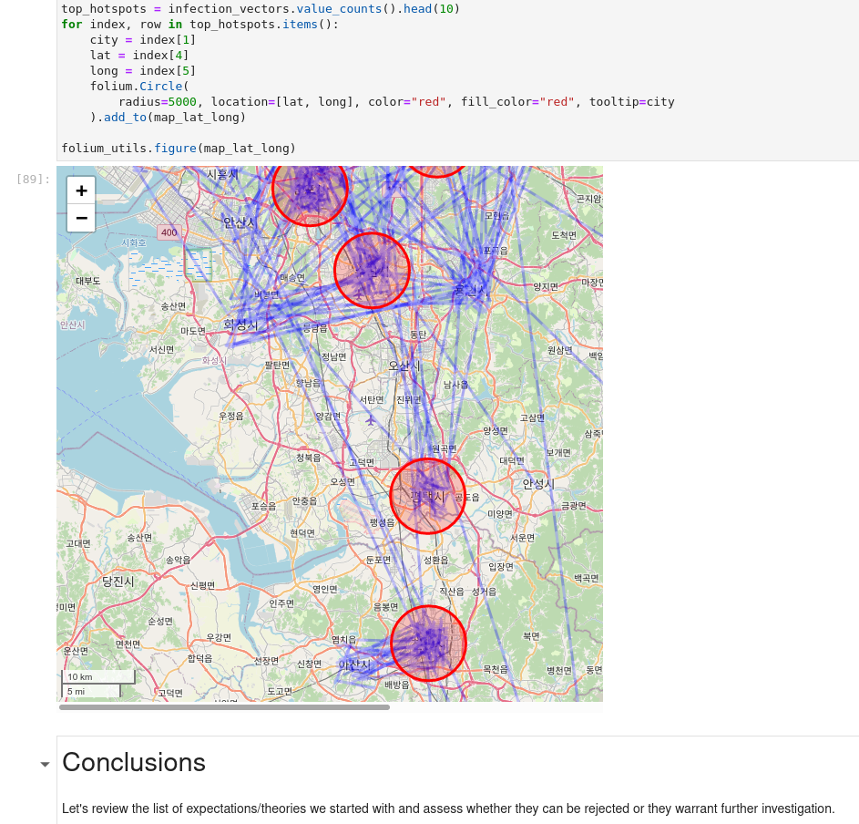

# Module 1 - Data Wrangling with Python

Module 1 is all about learning the basics:

- Skills
    - Python
    - Data Analysis
    - Data Cleaning
    - Data Visualization
    - Storytelling
    - Analyzing simple datasets
    - Communicating conclusions and outcomes
- Libraries/Frameworks
    - Numpy
    - Pandas
    - Docker
    - REST APIs
    - Matplotlib
    - Plotly
    - Seaborn
    - [PyPI](https://pypi.org/) package deployments

The content is split into 4 projects/sprints

## Sprint 1 - Deploying a calculator module to PyPI

**Project Requirements**: This project is about deploying a small calculator library to PyPI.

This project was simpler than the entrance test and provided a good learning playground for practicing basic python
features (TypeHinting, Testing, Creating a Fluent Interface in Python, etc...)

**Key Learnings**:

- Python basics
- Testing using [unittest](https://docs.python.org/3/library/unittest.html)
  and [hypothesis](https://pypi.org/project/hypothesis/)
- Packaging and distributing a custom python library

**Reviewer's highlights**:

> Score: 92

> All project is in a good shape, code works perfectly, unit tests are written very well it does cover a lot of corner
> cases. Pip installation works great.

## Sprint 2 - Data Analysis - Spotify Dataset

**Project Requirements**: Analyze a small dataset and extract key insights to answer the questions provided.

This project is the first Data Analysis project. It is guided and provides a preset list of questions, so we can just
focus on practicing hands-on data wrangling without distractions.

**Key Learnings**:

- `numpy` and `pandas` basics
- Basic visualization and plotting charts

**Reviewer's highlights**:

> Score: 93

> Project technical part meet all requirements. Figures are nicely formatted, easy to read code and overall
> understanding of the topic is good.

**Something fun**:
As someone who loves musical puns, this is the only dataset where I can have a variable
called [The_Corrs](https://en.wikipedia.org/wiki/The_Corrs) to store correlations!

## Sprint 3 - Data Wrangling - Coursera Dataset

**Project Requirements**: Use plotting libraries, visualizations and storytelling devices to analyze and create a story
from the Coursera dataset provided.

**Key Learnings**:

- Visualizing data using `matplotlib`, `plotly` and `seaborn`

**Reviewer's highlights**:

> Score: 100

> Brilliant project!
> * Very interesting approach to the proejct
> * Clear structure and good conclusions
> * Very high quality code
> * Nicely formatted visualisations
> * Good replies to questions with some interesting solutions suggested
> * Well written tests to custom utils

## Sprint 4 - Capstone Project - COVID Dataset

**Project Requirements**: You are one of the best data scientists in your country. The president of your
country asked you to analyze the COVID-19 patient-level data of South Korea and prepare your homeland for the next wave
of the pandemic. You, as the lead data scientist of your country have to create and prove a plan of fighting the
pandemics in your country by analyzing the provided data. You must get the most critical insights using learned data
science techniques and present them to the lead of your country.

**Key Learnings**:

- How to approach datasets that span across multiple tables
    - Infections, Locations, Patient Travel, Search engine trends, Government policies over time
- Visualizing infections on maps to track hot spots/at risk cities
- Making simple hypothesis (without implying/proving causality)

**Reviewer's highlights**:

> Score: 98

> This was big project and I can see that learner put a lot of effort to complete it. Presentation was very good,
> explain everything in 15 min. EDA is wide and deep, almost in all cross-sections data was validated/checked. Raised
> questions and answers (proofs) are solid and in good shape.

Check out the [ project preview](../notebook/4-covid/capstone.html)

# Module 2

Continue to ⏩ [Module 2](module2.md) to review the next set of projects.

<head>
    <meta name="robots" content="noindex">
    <meta name="Googlebot" content="noindex">
    <meta name="Bingbot" content="noindex">
    <meta name="Slurp" content="noindex">
    <meta name="DuckDuckBot" content="noindex">
    <meta name="facebot" content="noindex">
    <meta name="Baiduspider" content="noindex">
    <meta name="YandexBot" content="noindex">
    <meta name="ia_archiver" content="noindex">
</head>