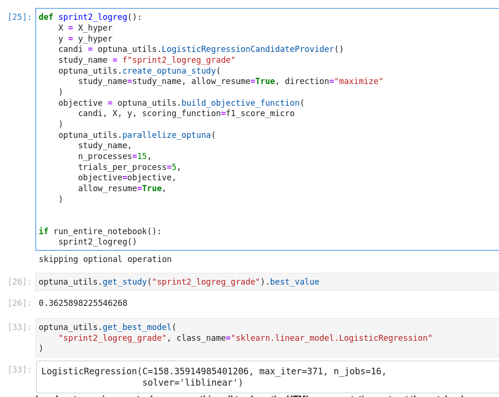

# Module 3 - Machine Learning

Module 3 was about machine learning:
- Supervised and unsupervised machine learning
    - Linear models
    - Tree-based models
    - Ensemble models
    - Boosted models
    - Clustering models
    - Dimensionality reduction models
    - Hyperparameter tuning
- ML fundamentals
    - Linear Algebra
    - Statistics & Hypothesis Testing
    - Calculus
- Working with datasets
    - Imbalanced datasets
    - Larger-than-memory datasets
    - Leveraging parallel computing
- Modelling
    - Model selection
    - Model evaluation
- Working with features
    - Feature selection
    - Feature engineering
- Libraries/Frameworks
    - scikit-learn
    - xgboost
    - lightgbm
    - catboost
- Cloud deployment
    - Google Cloud Platform
    - Streamlit
    - Flask
    - FastAPI
    - Docker

## Sprint 9 - Travel Insurance

**Project Requirements:** In this project, we perform market segmentation and customer analysis. The goal is to train a model to identify potential customers for travel insurance based on historical data.

**Key Learnings:**
- Supervised machine learning
- Model selection
- Feature selection
- Feature engineering
- Business perspective: selecting a metric to measure success
- Model evaluation
- Ensemble models: bagging, boosting, ...
- Creating custom loss functions

**Reviewer's highlights**:

> Score: 87

> - awesome business analysis and business requirement setting
> - I liked your modelling flow - goal setting, EDA, data preprocessing, modelling, eval --> iterate
> - loved your code. Great abstractions, OOP practices and generally - exemplary code quality
> - great advanced ML techniques, like custom scoring functions

Check out the [ project preview](../notebook/9-insurance/9-insurance.html)

## Sprint 10 - Stroke Risk

**Project Requirements:** This project requires training a model to predict stroke risk and deploying it with a simple web/mobile frontend so users can enter their data and see a predicted score/risk.

**Key Learnings:**
- Supervised machine learning, same as previous projects
- Model packaging and deployment
- Creating a small cloud app using Streamlit

**Reviewer's highlights**:

> Score: 96

> - Extraordinary job. You nailed it from the EDA to the evaluation and deployment. All the comments that I have are really minor ones:
> - Try to think of modeling as iterative process, spend more time trying different techniques (for example different imputation techniques, different scalers, dealing with imbalances). Scikit-learn pipelines give you ability to actually test even different combinations of them
> - Do not forget code quality: type hints should be used for the outputs of the function as well. Some larger functions might require docstrings; some charts were lacking namings as well.
> 
> I will hope to see more works like this :)

___

You can still find the deployed app over here: [https://ealmas-stroke-risk.hf.space/](https://ealmas-stroke-risk.hf.space/). Since it's on a free tier account, the first page load takes about a minute to spin up the service.

Check out the [ project preview](../notebook/10-stroke/10-stroke.html)

## Sprint 11 - Loan Prediction

**Project Requirements:** The first dataset over 2 million rows, with abundant EDA, cleaning and preprocessing, and 4 objectives:
- Predicting loan acceptance/rejection
- Predicting loan grade
- Predicting loan subgrade
- Predicting loan interest
- Create a custom backend with Flask
- Deploy the model to Google Cloud Platform

**Key Learnings:**
- Larger-than-memory data wrangling, cleaning, and model training using various techniques (Dask and custom libraries)
- Created custom wrapper for Optuna to leverage multi-core computation
    - Learned why Linux is loved when it comes to data science
- Developed custom utils to cache and snapshot intermediate steps in processing to ensure only non-cached steps are executed
    - This allowed to ensure that all steps of computation can be done end-to-end, as well as to skip intermediate steps when needed.

**Reviewer's highlights**:

> Score: 94

> Awesome job! Your project was very insightful and I really liked how you presented it. Also, I have no doubt that you are extremely good developer. With the set of skills you already have and Data Science knowledge, you would be a perfect fit for ML engineer position :) 

___

On multiprocessing:

___

On caching:

Check out the [ project preview](../notebook/11-loans/sprint0_data_cleaning.html)

## Sprint 12 - Home Credit

**Project Requirements:** This capstone project focuses on the end-to-end lifecycle:
- Translating business requirements into data science tasks
- Selecting evaluation metrics and goals
- EDA, data cleaning, statistical inferential analysis, ...
- Feature engineering and data preprocessing
- Using machine learning to solve business problems
- Deploying multiple machine learning models to the cloud

**Key Learnings:**
- This project did not necessarily require new skills but was a really good opportunity to practice and apply the skills already learned and to apply them in a more structured and methodical way.
- Most of the learnings and the most fun part was around further improving the library to parallelize, and store, all models and their hyperparameters, so they can be retrieved and analyzed at a later stage.
    - Expanding the underlying structure to support ensemble models, and to allow capturing hyperparameters for inner models.

**Reviewer's highlights**:

> Score: 

> - Great work! Extensive analysis and solution. Everything performed well from the technical side, all steps were taken to train and deploy the solution.
- You are very confident presenting and have a good understanding of the solution. Good job on trying out multiple different techniques in basically every step of your analysis - much work was put in it!

___

___

This project also had 3 confidential features that had a lot of predictive power but were labelled poorly intentionally. Those 3 confidential features also had some small gaps and missing values. One of the core goals was to try different imputation strategies to fill in the blanks, and to try to visualize how they spread and contribute to the final target label.

___

Some of the work to enhance the custom Optuna wrapper library:

Check out the [ project preview](../notebook/12-home-default/part1-cleaning.html)

# Module 4
Continue to ⏩ [Module 4 - Deep Learning](module4.md) to review the next set of projects.

