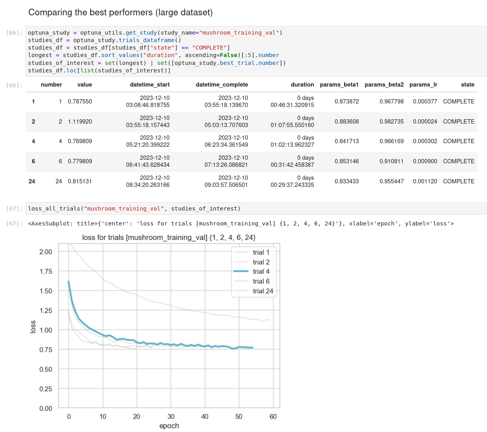
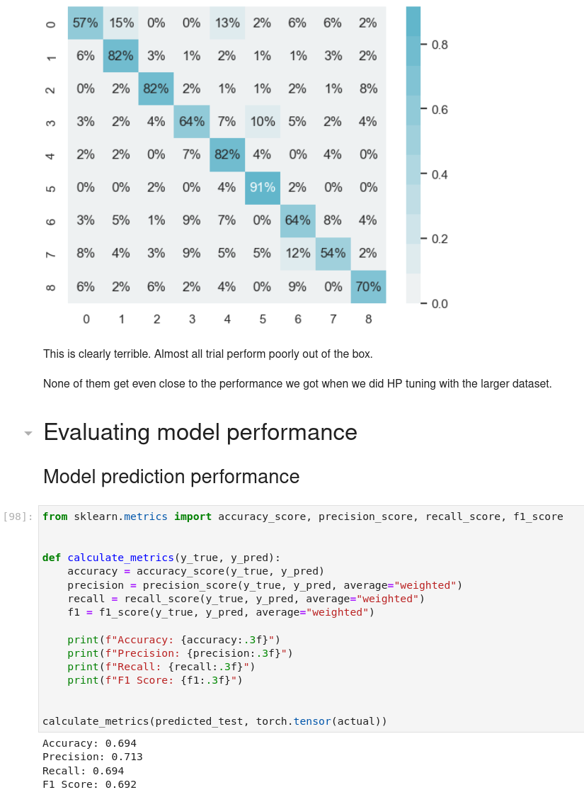
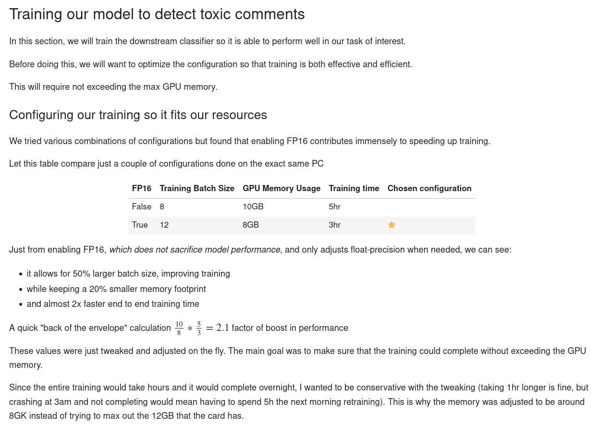
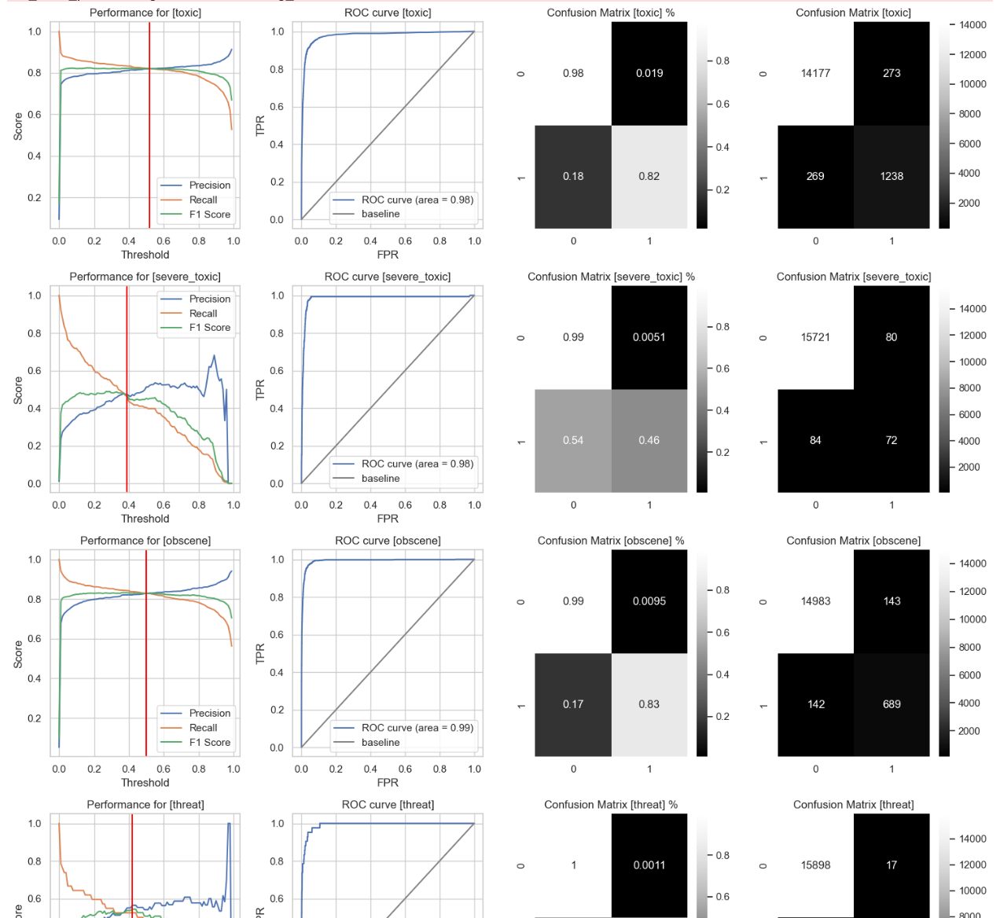
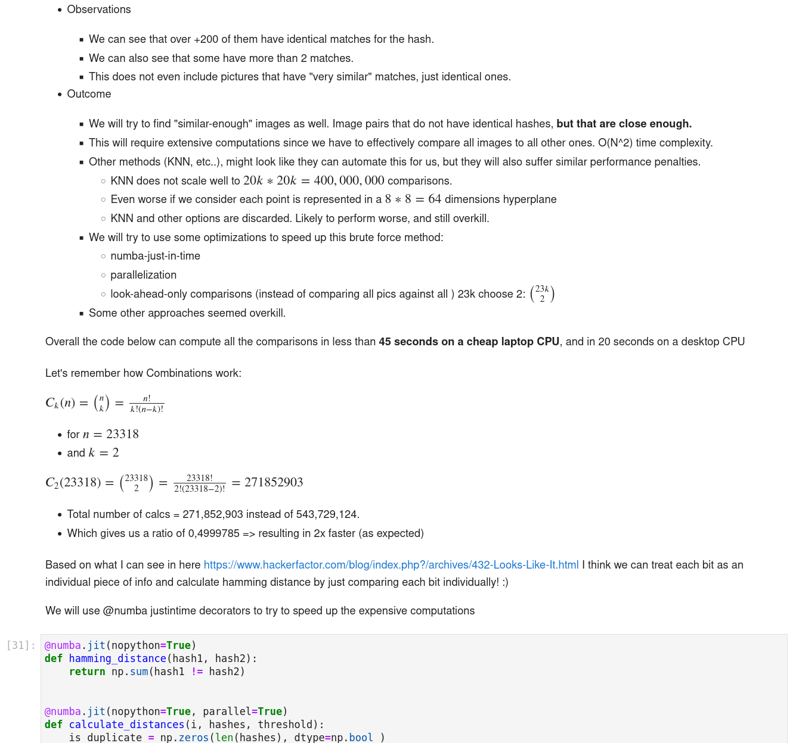
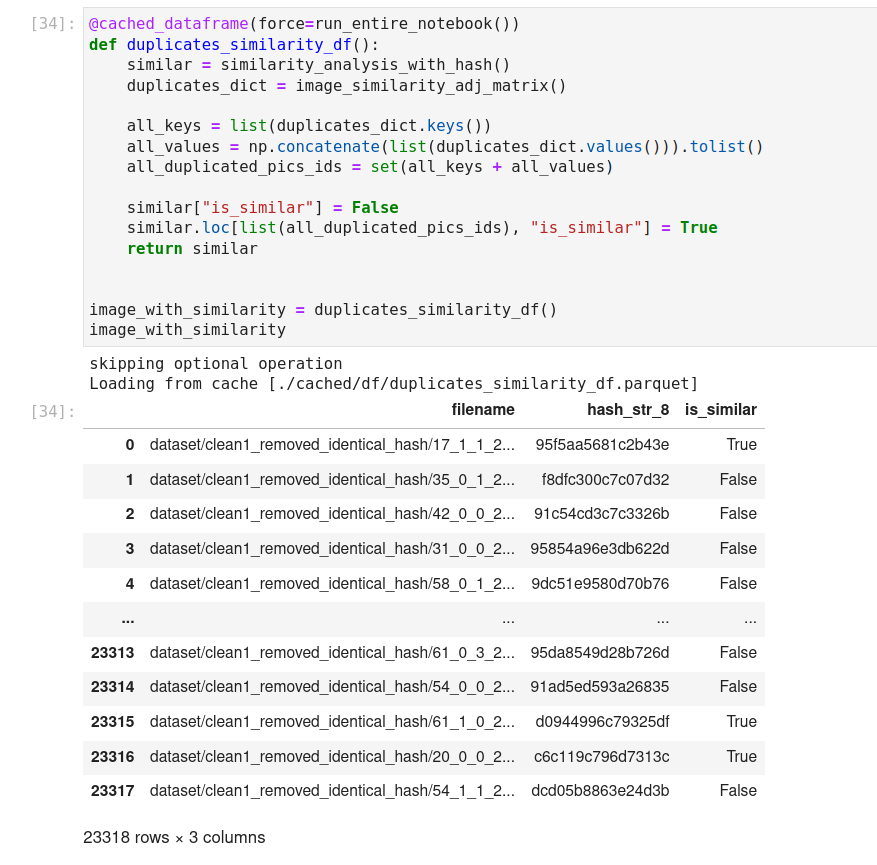
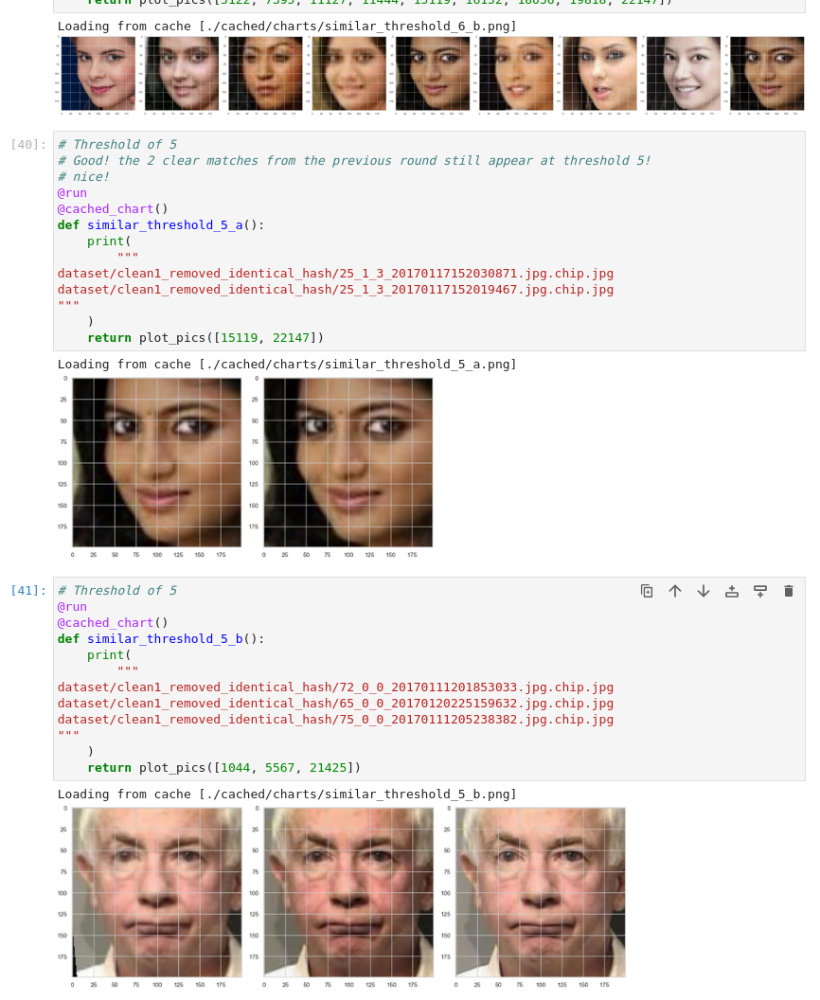
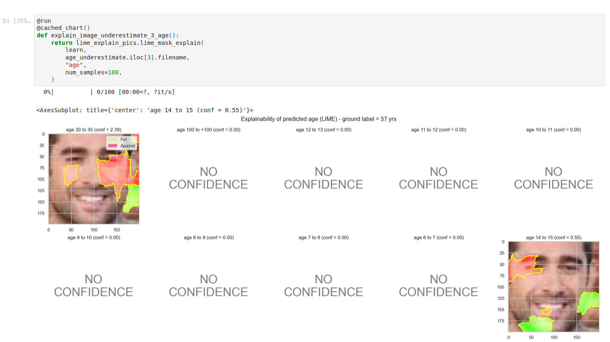
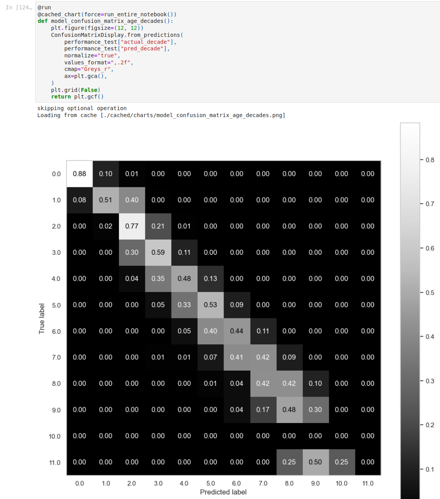
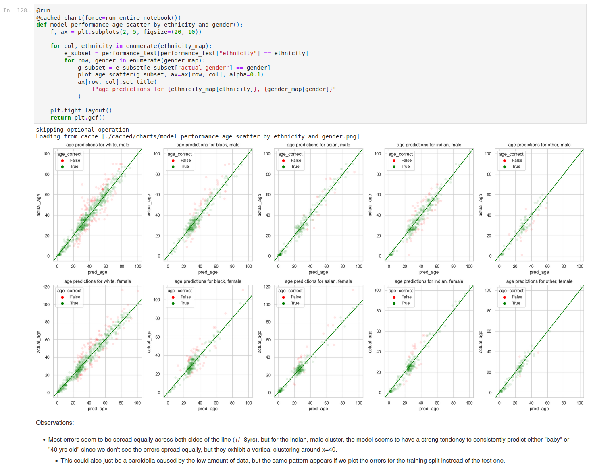

# Module 4 - Deep Learning

Module 4 is about deep learning:
- Deep learning
    - ANN - artificial neural networks
    - RNN - Recurrent Neural Networks
        - LSTMs - Long short-term memory
    - CNN - Convolutional Neural Networks
    - Autoencoders
    - Transfer learning
    - CV - computer vision
        - Binary, multi-class, and multi-label models
        - ResNet
    - NLP - natural language processing and sentiment analysis
        - BERT, DistilBERT, RoBERTa, and derived models
        - Self-attention
        - Transformers
        - Longformers
        - GPT-x
    - Data preprocessing techniques for CV and NLP
    - Practical AI ethics
        - Bias in decision-making
        - Machine learning ethics
        - AI security and exploits
        - Model interpretability and explainability
- Libraries/Frameworks
    - PyTorch
    - PyTorch Lightning
    - Fastai
    - TensorFlow
    - Hugging Face
    - Lime

## Sprint 13 - Mushroom Classification

**Project Requirements:** The first computer vision project focused on classifying pictures of mushrooms.

**Key Learnings:**
- How to apply transfer learning and fine-tuning to use an existing pretrained model for a new, but similar, purpose.
- Model comparison and evaluation
- Data preprocessing for computer vision tasks, comparing different models:

**Reviewer's highlights**:

> Score: 100

> Eduard made an incredible work within this task and even significantly exceeded the task’s requirements. 
> Everything - from the project structure, to Python code and ML modelling - all the things were prepared in brilliant quality and in super professional level.
> I have no anything to add to what is done there. Eduard put much of efforts, energy and creativity into this work. He clearly introduced the work covering all required parts: 
> - EDA,
> - data preparation & investigation
> - hyper parameter tuning
> - modelling
> - model evaluation
> - and conclusions
>
> Eduard has a very good attitude to the task and his introduction was almost professional. It is worth to mention that the Python code he developer included and uses Python decorator (it is very unique case in Turing college for this specific task). Decorators made the notebook look like very professional and structured. Mainly the code is based on OOP classes which fully satisfies PEP8 standards, so it was very easy and to review the work (despite the fact that I spent more than hour to read everything due to rich explanations and comments).
> 
> Eduard explained why he selected specific parameters for modelling; what is the logic behind about data pre-processing and balancing; what are roles of PyTorch functions and functionalities.
> 
> I appreciate that Eduard used Early stopping strategy and used Tensorboard to debug the model job(s). It is a sign of advanced level in data science and deep learning. 
Only one thing that I suggest to inspect in future projects is to evaluate model latency in different working conditions (as well as inference speed as Eduard did perfectly).

> I felt that we are discussing like senior data scientists vs. Senior data scientist. It was very interesting to discuss related topics such as ML certifications, career paths and high level strategies to be professional data scientist. I can say it was unique project review with very motivated and hard-working learner.
Appreciate time having with Eduard with this correction. Congratulations and good luck in future projects!

Check out the [ project preview](../notebook/13-mushrooms/mushrooms.html)

## Sprint 14 - Toxic Comments

**Project Requirements:** In this Natural Language Processing project, we are tasked with tuning a pretrained transformer (BERT) to create a multi-class classifier that can flag toxic comments in up to 6 different categories, in a single inference pass.

**Key Learnings:**
- How to apply transfer learning and fine-tuning to natural language processing tasks
- How to create multi-class classifiers and how to decide and fine-tune their loss functions
- Model comparison and evaluation
- Data preprocessing for natural language processing

**Reviewer's highlights**:

> Score: 96

> Eduard, your project is good and do not have any major errors or problems. I really like to see how you are organizing and presenting notebooks, It's easy to follow and understand. Your performed single string prediction demonstration also helps to see how full end-to-end solution is able to train model, evaluate, and predict new cases.

Optimizing the model training and evaluating the performance of all outputs:

Evaluating performance of all outputs:

Check out the [ project preview](../notebook/14-toxic-comments/toxic_comments.html)

## Sprint 15 - Facial Recognition

**Project Requirements:** This project requires training a single model that returns the age and gender of the person in the picture in a single pass, as well as exploring model bias, interpretability, and other issues that may arise.

**Key Learnings:**
- How to perform data preprocessing, deduplication, and similarity detection for image data
- Creating a single-pass end-to-end trainable deep learning model with multiple outputs
- Deciding and comparing different ways to assess its performance
- Using LIME for interpretability and assessing problematic points (in the model and in the training data), as well as bias and other issues that could be fixed in future iterations

**Reviewer's highlights**:

> Score: 100

> Eduard again made a brilliant project! He not only satisfied the task requirements, but exceeded that with a series of extra miles, by optimising the entire code with decorators, helper functions and packages. He made incredible prediction analysis concerning xAi and ethical AI guidelines and best practices. Everything was explained very well. EDA was also very insightful and rich of carefully prepared visualisations. All components of the projects looks very professional. 
Moreover, the oral presentation was very clear, as Eduard highlighted all the important parts of the project and answered & discussed reflecting to all questions I raised.
No more comments, except that it was one of the most professional work presented in TC at Data science course.
Gongratulation Eduard!

Performance considerations when looking for identical and similar faces:

Exploring the ideal threshold (Hamming distance) to ensure only identical images are detected and removed:

Assessing model explainability using LIME:

Assessing model performance:

Check out the [ project preview](../notebook/15-age-and-gender/computer_vision.html)